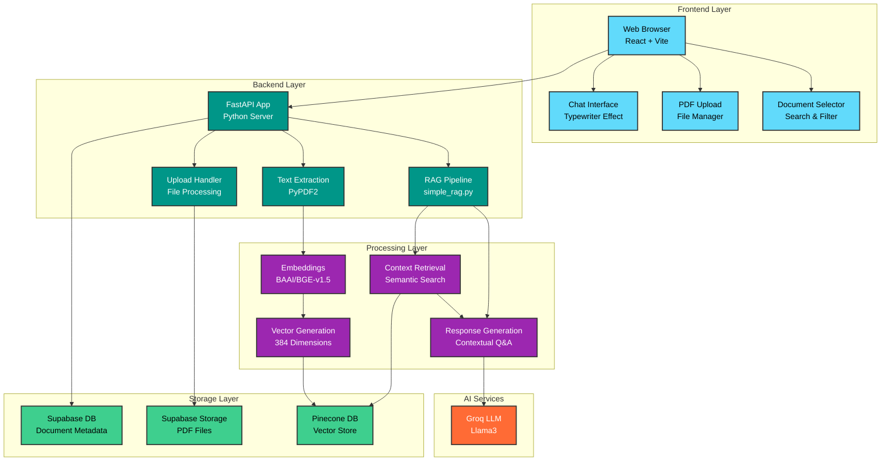

# AI Planet - Intelligent PDF Q&A System

A modern full-stack application that enables intelligent document analysis through RAG (Retrieval Augmented Generation). Upload PDFs, get AI-powered answers, and experience a beautiful chat interface with typewriter animations.

## 🎯 Overview

AI Planet is a sophisticated document Q&A system that combines:

- **Modern React Frontend** with beautiful UI and typewriter effects
- **FastAPI Backend** with RAG (Retrieval Augmented Generation)
- **Vector Database** for semantic search (Pinecone)
- **Database Storage** for document metadata (Supabase)
- **AI-Powered Responses** using Groq API (Llama3)

## ✨ Features

### Frontend Features

- 🎨 **Modern React Interface** - Built with React 19, Vite, and Tailwind CSS
- ⚡ **Typewriter Animation** - Smooth character-by-character AI response animation
- 💬 **Chat-like Interface** - Intuitive conversation flow
- 📱 **Responsive Design** - Works perfectly on all devices
- 🌙 **Dark/Light Mode** - Toggle between themes
- 📄 **PDF Management** - Upload, select, and manage documents
- 🔍 **Real-time Search** - Filter through uploaded documents
- 📊 **File Status Indicators** - Visual feedback for document processing

### Backend Features

- 📁 **PDF Upload & Processing** - Secure document handling with Supabase Storage
- 🧠 **Vector Embeddings** - High-quality embeddings using BAAI/BGE-small-en-v1.5
- 🗄️ **Vector Search** - Semantic search with Pinecone
- 🤖 **AI Q&A** - Context-aware responses using Groq API
- 📊 **Document Analytics** - Track file sizes, processing status, and metadata
- 🔄 **Real-time Processing** - Live status updates and error handling
- 🎯 **Document-Specific Queries** - Target specific PDFs or search across all

## 🏗️ Architecture



## 🚀 Getting Started

### Prerequisites

- Node.js 18+ and npm
- Python 3.8+
- Supabase account and project
- Pinecone account and API key
- Groq API key

### Frontend Setup

1. **Install Dependencies**

   ```bash
   cd Frontend
   npm install
   ```

2. **Start Development Server**

   ```bash
   npm run dev
   ```

3. **Build for Production**
   ```bash
   npm run build
   ```

### Backend Setup

1. **Install Dependencies**

   ```bash
   cd Backend
   pip install -r requirements.txt
   ```

2. **Environment Configuration**
   Create a `.env` file in the Backend directory with the following variables:

   ```env
   # Supabase Configuration
   SUPABASE_URL=https://your-project-id.supabase.co
   SUPABASE_KEY=your_supabase_service_role_key
   BUCKET_NAME=pdf-file

   # Pinecone Configuration
   PINECONE_DEFAULT_API_KEY=your_pinecone_api_key
   PINECONE_ENVIRONMENT=us-east-1
   PINECONE_INDEX_NAME=pdf-index

   # Groq API Configuration
   GROQ_API_KEY=your_groq_api_key
   ```

   > ⚠️ **Security Note**: Never commit the `.env` file to Git. It's already included in `.gitignore`.

3. **Start Backend Server**
   ```bash
   python main.py
   ```

## 🛠️ Technology Stack

### Frontend

- **React 19** - Modern UI library with latest features
- **Vite** - Fast build tool and dev server
- **Tailwind CSS** - Utility-first CSS framework
- **Lucide React** - Beautiful icon library
- **Axios** - HTTP client for API calls

### Backend

- **FastAPI** - Modern Python web framework
- **Supabase** - Database and file storage
- **Pinecone** - Vector database for embeddings
- **Groq API** - Fast LLM inference
- **PyPDF2** - PDF text extraction
- **Sentence Transformers** - Text embeddings

## 📂 Project Structure

```
AI-Planet/
├── Frontend/                 # React frontend application
│   ├── src/
│   │   ├── components/      # React components
│   │   │   ├── ChatMessage.jsx      # Individual chat messages with typewriter
│   │   │   ├── ChatArea.jsx         # Main chat interface
│   │   │   ├── FileSelector.jsx     # PDF selection component
│   │   │   └── UploadSection.jsx    # File upload interface
│   │   ├── hooks/           # Custom React hooks
│   │   │   ├── useChat.js           # Chat state management
│   │   │   └── useTypewriter.js     # Typewriter animation logic
│   │   ├── App.jsx          # Main app component
│   │   ├── main.jsx         # React entry point
│   │   └── styles.css       # Global styles and animations
│   ├── package.json         # Dependencies and scripts
│   └── vite.config.js       # Vite configuration
├── Backend/                  # FastAPI backend
│   ├── simple_rag.py        # Main RAG implementation
│   ├── main.py              # FastAPI server
│   ├── database.py          # Database operations and document management
│   └── requirements.txt     # Python dependencies
└── README.md                # This file
```

## 🎨 Key Features Explained

### Typewriter Animation

The frontend includes a sophisticated typewriter effect that:

- Only animates the latest AI response
- Never re-animates previous messages
- Provides smooth character-by-character typing
- Includes a blinking cursor during typing
- Maintains chat responsiveness

### Document Processing Pipeline

1. **Upload**: PDFs uploaded to Supabase Storage
2. **Extract**: Text extracted using PyPDF2
3. **Chunk**: Text split into semantic chunks with overlap
4. **Embed**: Chunks converted to vectors using BGE embeddings
5. **Store**: Vectors stored in Pinecone with metadata
6. **Query**: Semantic search retrieves relevant chunks
7. **Generate**: Groq LLM generates contextual responses

### Smart Chat Interface

- **Context Awareness**: Maintains conversation history
- **Document Selection**: Choose specific PDFs or search all
- **Real-time Feedback**: Loading states and error handling
- **Responsive Design**: Works on desktop and mobile
- **Theme Support**: Light and dark mode toggle

## 🔧 Configuration

### Database Schema (Supabase)

The system automatically creates a `documents` table with:

- Document metadata and processing status
- File information and statistics
- Error tracking and timestamps
- Vector count and processing details

### Vector Database (Pinecone)

- Index dimension: 384 (BGE-small-en-v1.5)
- Metadata filtering for document-specific searches
- Cosine similarity for semantic matching

## 🚀 Deployment

### Frontend Deployment

```bash
cd Frontend
npm run build
# Deploy the dist/ folder to your hosting service
```

### Backend Deployment

```bash
cd Backend
# Configure your production environment variables
# Deploy using your preferred method (Docker, Railway, etc.)
```

## 🎯 Usage

1. **Upload Documents**: Use the upload section to add PDF files
2. **Select Target**: Choose specific documents or search all
3. **Ask Questions**: Type questions in the chat interface
4. **Get AI Answers**: Watch the typewriter animation as AI responds
5. **Continue Conversation**: Build on previous answers with follow-up questions

## 🤝 Contributing

1. Fork the repository
2. Create a feature branch
3. Make your changes
4. Test thoroughly
5. Submit a pull request

## 🔗 Links

- **Frontend**: React + Vite + Tailwind CSS
- **Backend**: FastAPI + Supabase + Pinecone + Groq
- **Live Demo**: [Add your deployment URL here]

---

**Built with ❤️ using modern web technologies and AI**
@Dheeraj Chandra
